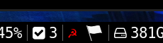

# Twilight Notifier

This python code checks your Gmail account (note: it's built using the Gmail API, so won't work with other email providers) for unread emails from Playdek about waiting Twilight Struggle turns.

It returns the number of unread emails and the opponents of waiting games. It contains a method to mark the messages as read, so once you've dealt with the notification you can flag them as such in Gmail.

## System tray

An experimental system tray icon is included. It uses the python `pystray` module. Configure the script as below and try it out.

## i3blocks

I use this in [i3blocks](https://github.com/vivien/i3blocks), a system bar containing 'blocklets' displaying handy information. It looks like this: . The code is included here as `twilight_i3blocks.py`.

## Prerequisites

This code requires the Google Client APIs, as specified in `requirements.txt`, and can be installed with `pip install -r requirements.txt`.

## Authentication

You will first need to enable the Client API and download a `credentials.json`: You can do that [here](https://developers.google.com/gmail/api/quickstart/python). Click on the big blue button.

The first time you run the code, it will authenticate you with Google and request permissions to read your email and modify (i.e. change labels). If you wish, you can easily modify the code to be read-only; see the beginning of `twilight.py`. 

## Questions, issues?

If anyone does happen to use this, please open an issue here and I will be sure to respond.
